# SYNAX - Business Flows & System Overview
# Επιχειρησιακές Ροές & Επισκόπηση Συστήματος

**Version:** 1.0
**Date / Ημερομηνία:** 2026-02-05
**Audience / Κοινό:** Developers, Stakeholders, Project Managers

---

## Table of Contents / Πίνακας Περιεχομένων

1. [Executive Summary](#1-executive-summary)
2. [System Overview](#2-system-overview)
3. [User Roles & Permissions](#3-user-roles--permissions)
4. [Entity Hierarchy](#4-entity-hierarchy)
5. [Business Flows](#5-business-flows)
   - [5.1 Project Setup Flow](#51-project-setup-flow)
   - [5.2 Equipment Lifecycle](#52-equipment-lifecycle)
   - [5.3 Issue Management Flow](#53-issue-management-flow)
   - [5.4 Checklist Workflow](#54-checklist-workflow)
   - [5.5 Label Management Flow](#55-label-management-flow)
   - [5.6 Inventory Management Flow](#56-inventory-management-flow)
   - [5.7 Reporting Flow](#57-reporting-flow)
6. [Status Transitions](#6-status-transitions)
7. [Integration Points](#7-integration-points)
8. [Glossary](#8-glossary)

---

## 1. Executive Summary

### English

**Synax** is a specialized **Construction Project Management System** designed for ICT installations (networks, CCTV, WiFi, smart systems). The platform enables teams to:

- **Manage Projects** with hierarchical structure (Project → Building → Floor → Room → Asset)
- **Track Equipment** from procurement to installation with full lifecycle visibility
- **Visual Floor Plans** with interactive pins showing rooms and assets
- **Digital Checklists** for installation verification with photo evidence
- **Issue Tracking** with priority-based workflows
- **Label Management** for asset identification and QR codes
- **Comprehensive Reporting** for internal teams and clients

**Target Users:** Construction companies, system integrators, ICT contractors
**Platform:** PWA (Progressive Web App) - works on web and mobile
**Key Feature:** Offline-first architecture for field work

### Ελληνικά

Το **Synax** είναι ένα εξειδικευμένο **Σύστημα Διαχείρισης Έργων Κατασκευής** σχεδιασμένο για εγκαταστάσεις ICT (δίκτυα, CCTV, WiFi, έξυπνα συστήματα). Η πλατφόρμα επιτρέπει στις ομάδες να:

- **Διαχειρίζονται Έργα** με ιεραρχική δομή (Έργο → Κτίριο → Όροφος → Χώρος → Εξοπλισμός)
- **Παρακολουθούν Εξοπλισμό** από την προμήθεια μέχρι την εγκατάσταση
- **Διαδραστικές Κατόψεις** με pins που δείχνουν χώρους και εξοπλισμό
- **Ψηφιακά Checklists** για επαλήθευση εγκατάστασης με φωτογραφίες
- **Διαχείριση Προβλημάτων** με ροές εργασίας βάσει προτεραιότητας
- **Διαχείριση Ετικετών** για αναγνώριση εξοπλισμού και QR codes
- **Αναφορές** για εσωτερικές ομάδες και πελάτες

**Χρήστες-Στόχος:** Κατασκευαστικές εταιρείες, system integrators, εργολάβοι ICT
**Πλατφόρμα:** PWA (Progressive Web App) - λειτουργεί σε web και mobile
**Βασικό Χαρακτηριστικό:** Offline-first αρχιτεκτονική για εργασία στο πεδίο

---

## 2. System Overview

### Architecture Diagram / Διάγραμμα Αρχιτεκτονικής

```
┌─────────────────────────────────────────────────────────────────────┐
│                         SYNAX PLATFORM                               │
├─────────────────────────────────────────────────────────────────────┤
│                                                                      │
│   ┌─────────────┐    ┌─────────────┐    ┌─────────────┐            │
│   │   ADMIN     │    │     PM      │    │ TECHNICIAN  │            │
│   │  Dashboard  │    │  Projects   │    │ Field Work  │            │
│   └──────┬──────┘    └──────┬──────┘    └──────┬──────┘            │
│          │                  │                  │                    │
│          └──────────────────┼──────────────────┘                    │
│                             ▼                                        │
│   ┌─────────────────────────────────────────────────────────────┐   │
│   │                    FRONTEND (React PWA)                      │   │
│   │  • Interactive Floor Plans (Konva.js)                       │   │
│   │  • Real-time Status Updates                                 │   │
│   │  • Photo Capture & Upload                                   │   │
│   │  • Offline Support (IndexedDB)                              │   │
│   └─────────────────────────────────────────────────────────────┘   │
│                             │                                        │
│                             ▼                                        │
│   ┌─────────────────────────────────────────────────────────────┐   │
│   │                    BACKEND (Fastify API)                     │   │
│   │  • RESTful Endpoints                                        │   │
│   │  • JWT Authentication                                       │   │
│   │  • File Processing                                          │   │
│   │  • Report Generation                                        │   │
│   └─────────────────────────────────────────────────────────────┘   │
│                             │                                        │
│                             ▼                                        │
│   ┌─────────────────────────────────────────────────────────────┐   │
│   │                    DATABASE (PostgreSQL)                     │   │
│   │  • Projects, Buildings, Floors, Rooms, Assets               │   │
│   │  • Checklists, Issues, Inventory                            │   │
│   │  • Labels, Reports, Users                                   │   │
│   └─────────────────────────────────────────────────────────────┘   │
│                                                                      │
└─────────────────────────────────────────────────────────────────────┘
```

### Tech Stack

| Layer | Technology | Purpose |
|-------|------------|---------|
| **Frontend** | React 18 + TypeScript | UI Framework |
| | Vite | Build Tool |
| | TailwindCSS v4 | Styling |
| | Konva.js | Interactive Floor Plans |
| | Zustand | State Management |
| **Backend** | Node.js + Fastify | API Server |
| | Prisma ORM | Database Access |
| | JWT | Authentication |
| **Database** | PostgreSQL | Data Storage |
| **Infrastructure** | Docker | Containerization |
| | Nginx | Reverse Proxy |

---

## 3. User Roles & Permissions

### Role Hierarchy / Ιεραρχία Ρόλων

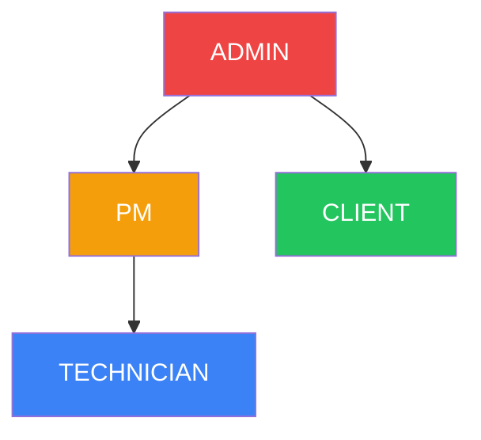

### Permissions Matrix / Πίνακας Δικαιωμάτων

| Permission / Δικαίωμα | ADMIN | PM | TECHNICIAN | CLIENT |
|----------------------|:-----:|:--:|:----------:|:------:|
| **Users / Χρήστες** |
| Manage Users | ✅ | ❌ | ❌ | ❌ |
| View User List | ✅ | ✅ | ❌ | ❌ |
| **Projects / Έργα** |
| Create Project | ✅ | ✅ | ❌ | ❌ |
| Edit Project | ✅ | ✅ | ❌ | ❌ |
| Delete Project | ✅ | ❌ | ❌ | ❌ |
| View All Projects | ✅ | ✅ | ❌ | ❌ |
| View Assigned Projects | ✅ | ✅ | ✅ | ✅ |
| **Buildings & Floors / Κτίρια & Όροφοι** |
| Manage Buildings | ✅ | ✅ | ❌ | ❌ |
| Manage Floors | ✅ | ✅ | ❌ | ❌ |
| Upload Floor Plans | ✅ | ✅ | ❌ | ❌ |
| **Rooms / Χώροι** |
| Create Rooms | ✅ | ✅ | ✅ | ❌ |
| Edit Rooms | ✅ | ✅ | ✅ | ❌ |
| Position Pins | ✅ | ✅ | ✅ | ❌ |
| **Assets / Εξοπλισμός** |
| Add Assets | ✅ | ✅ | ✅ | ❌ |
| Edit Assets | ✅ | ✅ | ✅ | ❌ |
| Delete Assets | ✅ | ✅ | ❌ | ❌ |
| Change Status | ✅ | ✅ | ✅ | ❌ |
| **Checklists** |
| Complete Items | ✅ | ✅ | ✅ | ❌ |
| Upload Photos | ✅ | ✅ | ✅ | ❌ |
| View Checklists | ✅ | ✅ | ✅ | ✅ |
| **Issues / Προβλήματα** |
| Create Issues | ✅ | ✅ | ✅ | ✅ |
| Resolve Issues | ✅ | ✅ | ✅ | ❌ |
| Close Issues | ✅ | ✅ | ❌ | ❌ |
| **Inventory / Αποθήκη** |
| Manage Inventory | ✅ | ✅ | ✅ | ❌ |
| View Inventory | ✅ | ✅ | ✅ | ❌ |
| **Labels / Ετικέτες** |
| Generate Labels | ✅ | ✅ | ✅ | ❌ |
| Assign Labels | ✅ | ✅ | ✅ | ❌ |
| **Reports / Αναφορές** |
| Internal Reports | ✅ | ✅ | ❌ | ❌ |
| Client Reports | ✅ | ✅ | ❌ | ✅ |
| Export PDF | ✅ | ✅ | ❌ | ✅ |
| **Settings / Ρυθμίσεις** |
| System Settings | ✅ | ❌ | ❌ | ❌ |
| Lookups Management | ✅ | ✅ | ❌ | ❌ |

### Role Descriptions / Περιγραφές Ρόλων

#### ADMIN (Διαχειριστής)
- Full system access / Πλήρης πρόσβαση
- User management / Διαχείριση χρηστών
- System configuration / Διαμόρφωση συστήματος
- All project operations / Όλες οι λειτουργίες έργων

#### PM - Project Manager (Υπεύθυνος Έργου)
- Project creation and management / Δημιουργία και διαχείριση έργων
- Team assignment / Ανάθεση ομάδας
- Floor plan management / Διαχείριση κατόψεων
- Report generation / Δημιουργία αναφορών
- Issue oversight / Επίβλεψη προβλημάτων

#### TECHNICIAN (Τεχνικός)
- Field work execution / Εκτέλεση εργασιών πεδίου
- Asset installation / Εγκατάσταση εξοπλισμού
- Checklist completion / Ολοκλήρωση checklists
- Photo documentation / Φωτογραφική τεκμηρίωση
- Issue reporting / Αναφορά προβλημάτων

#### CLIENT (Πελάτης)
- Read-only project view / Προβολή έργου μόνο για ανάγνωση
- Client reports access / Πρόσβαση σε αναφορές πελάτη
- Issue creation / Δημιουργία προβλημάτων
- Sign-off capability / Δυνατότητα υπογραφής

---

## 4. Entity Hierarchy

### Data Model Overview / Επισκόπηση Μοντέλου Δεδομένων

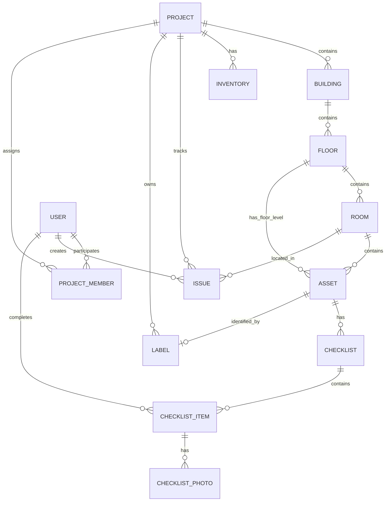

### Hierarchy Tree / Δέντρο Ιεραρχίας

```
🏢 PROJECT (Έργο)
├── 📋 Project Info (Πληροφορίες Έργου)
│   ├── Name, Description
│   ├── Client Name
│   ├── Location
│   ├── Status (PLANNING → IN_PROGRESS → COMPLETED → ARCHIVED)
│   └── Start/End Dates
│
├── 👥 Team Members (Μέλη Ομάδας)
│   └── User + Role assignment
│
├── 🏗️ BUILDING (Κτίριο)
│   ├── Building Info
│   ├── Building Floor Plan (optional)
│   │
│   └── 📐 FLOOR (Όροφος)
│       ├── Floor Info (Name, Level)
│       ├── Floor Plan Image
│       │
│       ├── 🚪 ROOM (Χώρος)
│       │   ├── Room Info (Name, Type, Status)
│       │   ├── Pin Position (X, Y)
│       │   ├── Room Floor Plan (optional)
│       │   │
│       │   └── 📦 ASSET (Εξοπλισμός - Room Level)
│       │       ├── Asset Info (Name, Model, Serial, MAC, IP)
│       │       ├── Status (IN_STOCK → INSTALLED → CONFIGURED → VERIFIED)
│       │       ├── Pin Position (X, Y)
│       │       ├── Label Assignment
│       │       └── Checklists
│       │
│       └── 📦 ASSET (Εξοπλισμός - Floor Level)
│           └── (Same as Room-level Asset)
│
├── 📦 INVENTORY (Αποθήκη)
│   ├── Equipment (Εξοπλισμός)
│   └── Materials (Υλικά)
│
├── 🏷️ LABELS (Ετικέτες)
│   └── Code, Type, Status, Asset Assignment
│
├── ⚠️ ISSUES (Προβλήματα)
│   ├── Issue Info
│   ├── Photos
│   └── Comments
│
└── 📊 REPORTS (Αναφορές)
    ├── Summary
    ├── Client
    └── Internal
```

### Key Relationships / Βασικές Σχέσεις

| Parent | Child | Relationship | Description |
|--------|-------|--------------|-------------|
| Project | Building | 1:N | Ένα έργο έχει πολλά κτίρια |
| Building | Floor | 1:N | Ένα κτίριο έχει πολλούς ορόφους |
| Floor | Room | 1:N | Ένας όροφος έχει πολλούς χώρους |
| Floor | Asset | 1:N | Floor-level assets (π.χ. switches σε διάδρομο) |
| Room | Asset | 1:N | Room-level assets |
| Asset | Checklist | 1:N | Κάθε asset έχει checklists |
| Asset | Label | 1:1 | Κάθε asset μπορεί να έχει μια ετικέτα |
| Project | Label | 1:N | Τα labels ανήκουν σε project |

---

## 5. Business Flows

### 5.1 Project Setup Flow

#### Flow Diagram / Διάγραμμα Ροής

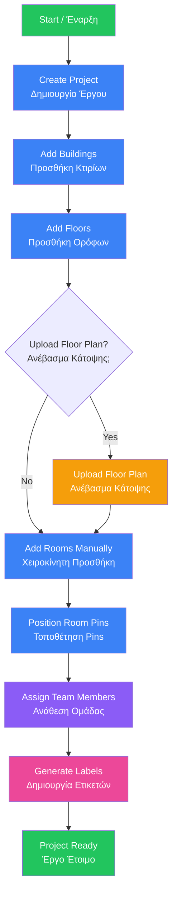

#### Steps Detail / Λεπτομέρειες Βημάτων

| Step | Actor | Action | System Response |
|------|-------|--------|-----------------|
| 1 | PM | Create new project | Project created with PLANNING status |
| 2 | PM | Add building(s) | Buildings linked to project |
| 3 | PM | Add floors per building | Floors created with level numbers |
| 4 | PM | Upload floor plan images | Images stored, canvas ready |
| 5 | PM | Add rooms | Rooms created per floor |
| 6 | PM/Tech | Click on floor plan | Pin positioned at coordinates |
| 7 | PM | Add team members | Users assigned with roles |
| 8 | PM | Generate label batch | Labels created with codes |
| 9 | - | Change status to IN_PROGRESS | Work can begin |

---

### 5.2 Equipment Lifecycle

#### State Machine / Μηχανή Καταστάσεων

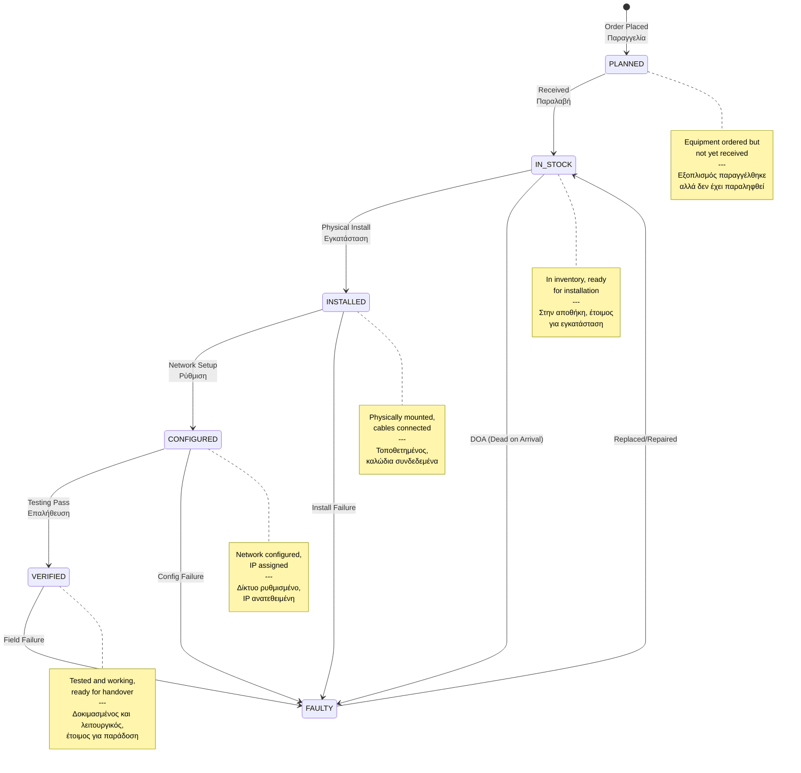

#### Lifecycle Flow / Ροή Κύκλου Ζωής

```mermaid
flowchart LR
    subgraph Procurement [Προμήθεια]
        A[Order<br/>Παραγγελία] --> B[Receive<br/>Παραλαβή]
    end

    subgraph Installation [Εγκατάσταση]
        B --> C[Add to Inventory<br/>Προσθήκη στο Stock]
        C --> D[Assign Label<br/>Ανάθεση Ετικέτας]
        D --> E[Place on Floor Plan<br/>Τοποθέτηση στην Κάτοψη]
        E --> F[Physical Install<br/>Φυσική Εγκατάσταση]
    end

    subgraph Configuration [Ρύθμιση]
        F --> G[Network Config<br/>Ρύθμιση Δικτύου]
        G --> H[Testing<br/>Δοκιμές]
    end

    subgraph Verification [Επαλήθευση]
        H --> I[Checklist Complete<br/>Ολοκλήρωση Checklist]
        I --> J[Sign-off<br/>Υπογραφή]
    end
```

#### Equipment Statuses / Καταστάσεις Εξοπλισμού

| Status | Color | Description EN | Περιγραφή EL |
|--------|-------|----------------|--------------|
| PLANNED | Gray | Ordered, awaiting delivery | Παραγγελία σε αναμονή |
| IN_STOCK | Blue | In inventory, ready to install | Στην αποθήκη, έτοιμος |
| INSTALLED | Yellow | Physically installed | Φυσικά εγκατεστημένος |
| CONFIGURED | Orange | Network configured | Δίκτυο ρυθμισμένο |
| VERIFIED | Green | Tested and approved | Ελεγμένος και εγκεκριμένος |
| FAULTY | Red | Defective, needs replacement | Ελαττωματικός |

---

### 5.3 Issue Management Flow

#### Issue Workflow / Ροή Εργασίας Προβλημάτων

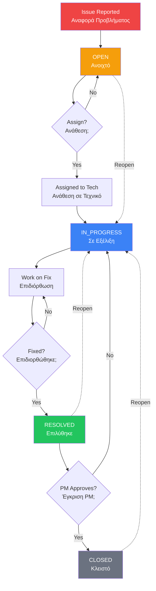

#### Priority Matrix / Πίνακας Προτεραιοτήτων

| Priority | Response Time | Examples EN | Παραδείγματα EL |
|----------|---------------|-------------|-----------------|
| 🔴 CRITICAL | Immediate | Safety issues, major blockage | Θέματα ασφάλειας, μεγάλο εμπόδιο |
| 🟠 HIGH | < 24 hours | Functionality impacted | Επηρεάζεται η λειτουργικότητα |
| 🟡 MEDIUM | < 3 days | Standard fixes needed | Απαιτούνται τυπικές διορθώσεις |
| ⚪ LOW | < 1 week | Minor cosmetic issues | Μικρά αισθητικά προβλήματα |

#### Issue Components / Στοιχεία Προβλήματος

```
⚠️ ISSUE
├── 📝 Title & Description (Τίτλος & Περιγραφή)
├── 🎯 Priority (LOW / MEDIUM / HIGH / CRITICAL)
├── 📍 Location (Project → Room)
├── 👤 Created By (Δημιουργός)
├── 🔧 Caused By (Υπαίτιος - optional)
├── 📸 Photos (Evidence)
├── 💬 Comments (Discussion thread)
└── 📅 Timestamps (Created, Resolved)
```

---

### 5.4 Checklist Workflow

#### Checklist Types / Τύποι Checklists

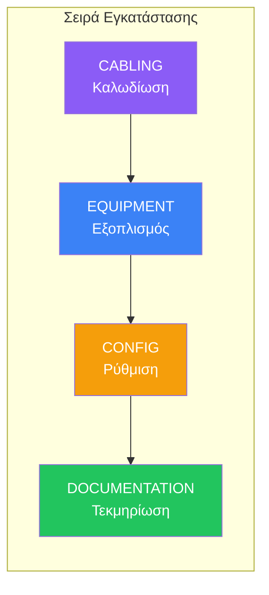

#### Checklist Flow / Ροή Checklist

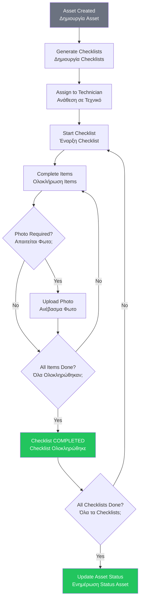

#### Checklist Status Progress / Πρόοδος Κατάστασης

| Status | Progress | Description |
|--------|----------|-------------|
| NOT_STARTED | 0% | Κανένα item ολοκληρωμένο |
| IN_PROGRESS | 1-99% | Μερικά items ολοκληρωμένα |
| COMPLETED | 100% | Όλα τα items ολοκληρωμένα |

#### Standard Checklist Items / Τυπικά Items

**CABLING Checklist:**
- [ ] Cable routed correctly / Καλώδιο σωστά τοποθετημένο
- [ ] Cable properly terminated / Σωστό τερματισμό
- [ ] Cable labeled at both ends / Ετικέτα και στα δύο άκρα
- [ ] Cable tested and passed / Δοκιμή επιτυχής
- [ ] Cable management neat / Τακτοποιημένα καλώδια

**EQUIPMENT Checklist:**
- [ ] Device mounted securely / Συσκευή στερεωμένη
- [ ] Power connected / Τροφοδοσία συνδεδεμένη
- [ ] LED indicators normal / LEDs κανονικά
- [ ] Physical inspection passed / Οπτικός έλεγχος OK
- [ ] Device accessible / Συσκευή προσβάσιμη

**CONFIG Checklist:**
- [ ] IP address configured / IP διεύθυνση ρυθμισμένη
- [ ] Network connectivity tested / Δίκτυο δοκιμασμένο
- [ ] VLAN configured correctly / VLAN σωστά ρυθμισμένο
- [ ] Device accessible remotely / Απομακρυσμένη πρόσβαση OK
- [ ] Configuration backed up / Backup ρυθμίσεων

**DOCUMENTATION Checklist:**
- [ ] As-built drawing updated / Σχέδιο as-built ενημερωμένο
- [ ] Device label attached / Ετικέτα τοποθετημένη
- [ ] Serial number recorded / Serial number καταγεγραμμένο
- [ ] MAC address recorded / MAC address καταγεγραμμένη
- [ ] Handover document ready / Έγγραφο παράδοσης έτοιμο

---

### 5.5 Label Management Flow

#### Label Lifecycle / Κύκλος Ζωής Ετικέτας

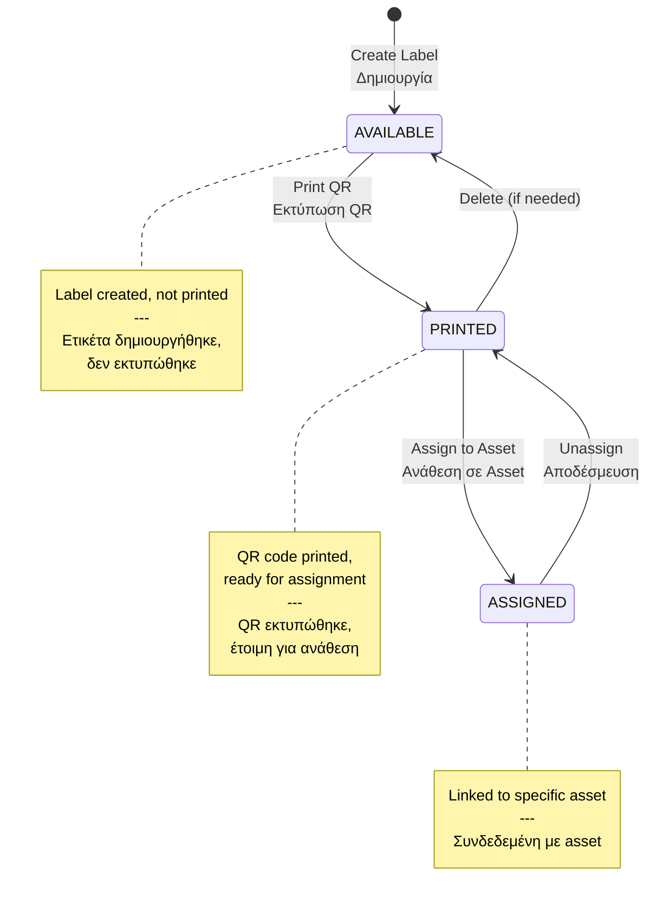

#### Label Types / Τύποι Ετικετών

| Type | Code Format | Purpose EN | Σκοπός EL |
|------|-------------|------------|-----------|
| ASSET | AST-001 | Equipment identification | Αναγνώριση εξοπλισμού |
| CABLE | CBL-001 | Cable labeling | Ετικέτες καλωδίων |
| RACK | RCK-001 | Rack positions | Θέσεις rack |
| ROOM | RM-001 | Room identification | Αναγνώριση χώρου |

#### Batch Generation Flow / Ροή Μαζικής Δημιουργίας

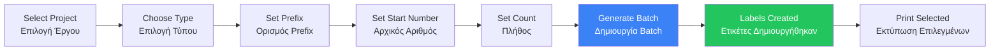

#### Label Assignment / Ανάθεση Ετικέτας

```
Asset Edit Form:
┌─────────────────────────────────────┐
│ Label Code: [Dropdown ▼]            │
│ ┌─────────────────────────────────┐ │
│ │ ○ AST-001 (Available)           │ │
│ │ ○ AST-002 (Available)           │ │
│ │ ● AST-003 (Current)             │ │
│ │ ○ AST-004 (Printed)             │ │
│ └─────────────────────────────────┘ │
└─────────────────────────────────────┘
```

---

### 5.6 Inventory Management Flow

#### Inventory Categories / Κατηγορίες Αποθήκης

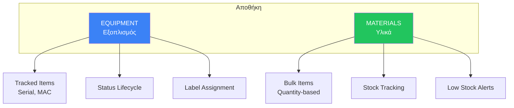

#### Stock Movement Flow / Ροή Κινήσεων Stock

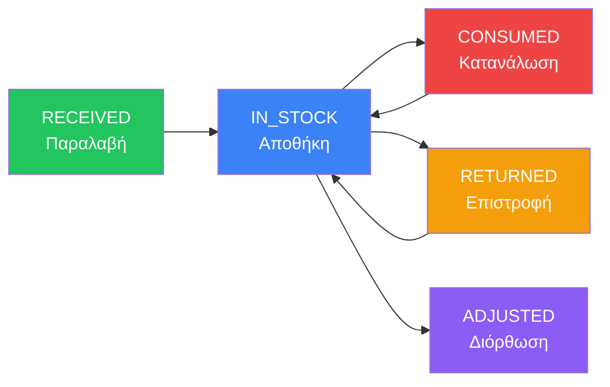

#### Stock Calculation / Υπολογισμός Stock

```
Current Stock = Quantity Received - Quantity Used

Low Stock Alert = Current < max(5, Received × 10%)

Out of Stock = Current = 0
```

| Action | Effect on Received | Effect on Used |
|--------|-------------------|----------------|
| RECEIVED | +quantity | - |
| CONSUMED | - | +quantity |
| RETURNED | - | -quantity |
| ADJUSTED | varies | varies |

---

### 5.7 Reporting Flow

#### Report Types / Τύποι Αναφορών

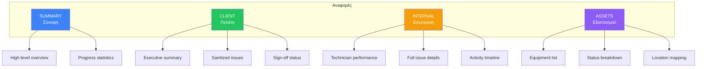

#### Report Generation Flow / Ροή Δημιουργίας Αναφοράς

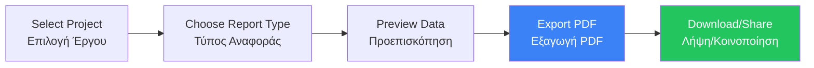

#### Report Metrics / Μετρήσεις Αναφορών

| Metric | Description EN | Περιγραφή EL |
|--------|----------------|--------------|
| Progress % | Overall completion | Συνολική πρόοδος |
| Rooms Completed | Rooms with COMPLETED status | Ολοκληρωμένοι χώροι |
| Assets Installed | Assets with INSTALLED+ status | Εγκατεστημένος εξοπλισμός |
| Open Issues | Issues not CLOSED | Ανοιχτά προβλήματα |
| Checklist Completion | Average checklist progress | Μέση πρόοδος checklists |

---

## 6. Status Transitions

### Project Status / Κατάσταση Έργου

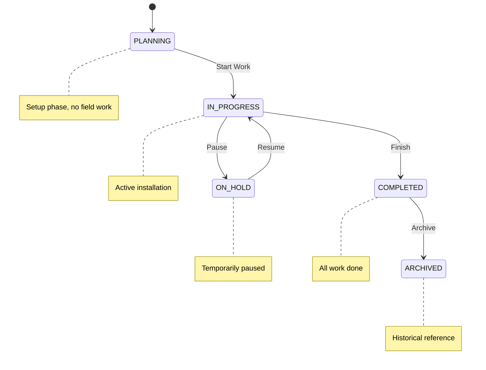

### Room Status / Κατάσταση Χώρου

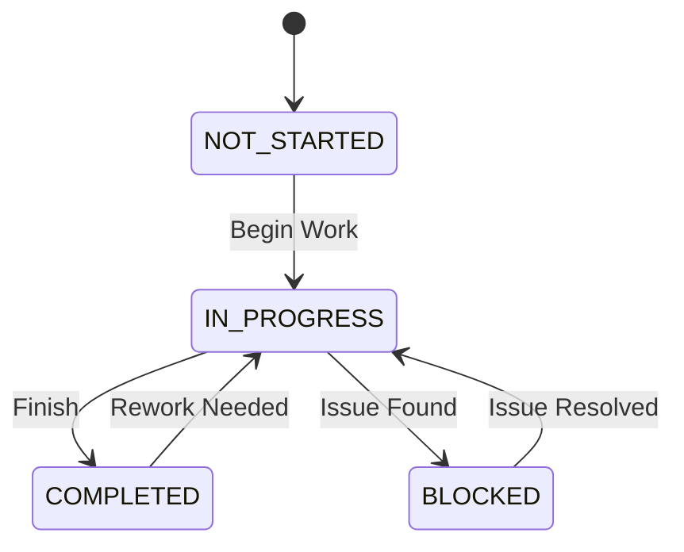

### Asset Status / Κατάσταση Εξοπλισμού

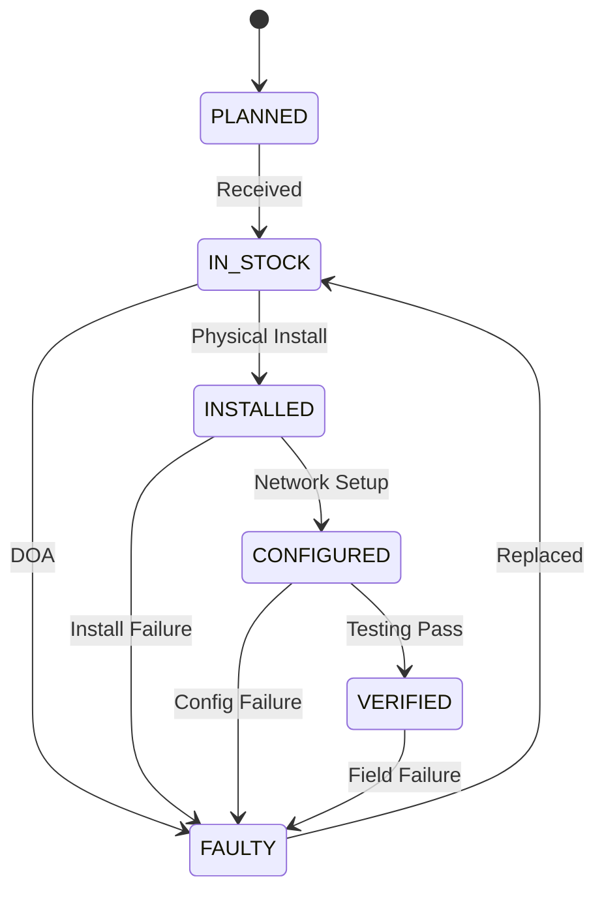

### Issue Status / Κατάσταση Προβλήματος

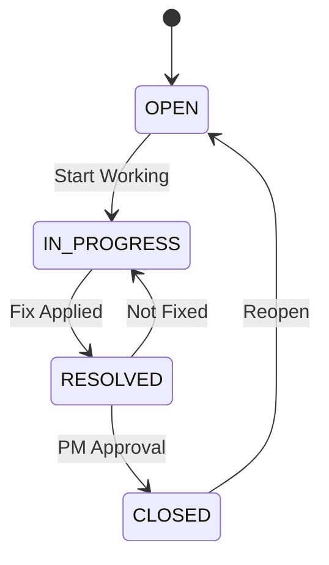

### Checklist Status / Κατάσταση Checklist

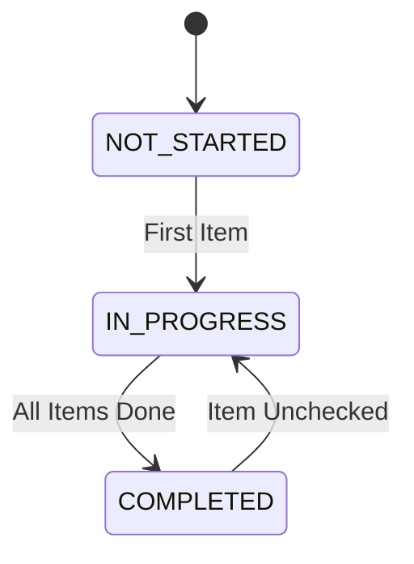

### Label Status / Κατάσταση Ετικέτας

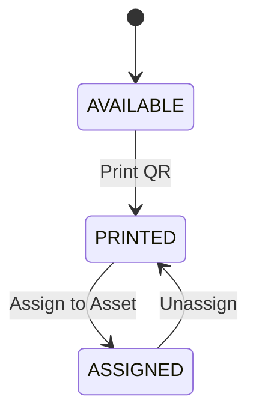

---

## 7. Integration Points

### Floor Plan Canvas / Καμβάς Κάτοψης

```
┌─────────────────────────────────────────────────────────────────┐
│ Floor Plan Canvas (Konva.js)                                     │
├─────────────────────────────────────────────────────────────────┤
│                                                                  │
│  ┌─────────────────────────────────────────────────────────┐    │
│  │                    Floor Plan Image                      │    │
│  │                                                          │    │
│  │    📍 Room Pin (click to view/edit room)                │    │
│  │         • Color = Room Status                            │    │
│  │         • Draggable in Edit Mode                         │    │
│  │                                                          │    │
│  │    📦 Asset Pin (click to view/edit asset)              │    │
│  │         • Icon = Asset Type                              │    │
│  │         • Draggable in Edit Mode                         │    │
│  │                                                          │    │
│  └─────────────────────────────────────────────────────────┘    │
│                                                                  │
│  Controls: [Zoom +] [Zoom -] [Reset] [Edit Mode] [Fullscreen]   │
│                                                                  │
└─────────────────────────────────────────────────────────────────┘
```

### Click Workflows / Ροές Κλικ

**On Floor Plan (Empty area):**
```
Click → Popup: "What to add?"
         ├── Add Room → Create Room Form
         └── Add Asset → Select from Inventory
```

**On Room Pin:**
```
Click → Popup: Room Details
         ├── View Details → Navigate to Room
         ├── Edit → Edit Room Form
         └── Delete → Confirm Delete
```

**On Asset Pin:**
```
Click → Popup: Asset Details
         ├── View Details → Navigate to Asset
         ├── Edit → Edit Asset Form
         └── Remove from Plan → Unplace Asset
```

### API Endpoints Summary / Σύνοψη API Endpoints

| Module | Base Path | Key Endpoints |
|--------|-----------|---------------|
| Auth | `/api/auth` | login, register, refresh |
| Projects | `/api/projects` | CRUD, members, dashboard |
| Buildings | `/api/buildings` | CRUD |
| Floors | `/api/floors` | CRUD, upload plan |
| Rooms | `/api/rooms` | CRUD, by floor |
| Assets | `/api/assets` | CRUD, search, QR |
| Checklists | `/api/checklists` | by asset, items, photos |
| Issues | `/api/issues` | CRUD, comments, photos |
| Inventory | `/api/inventory` | equipment, materials, stock |
| Labels | `/api/labels` | batch, assign, print |
| Reports | `/api/reports` | summary, client, internal, PDF |
| Lookups | `/api/lookups` | room types, manufacturers, etc. |

---

## 8. Glossary

### English Terms

| Term | Definition |
|------|------------|
| **Asset** | Equipment installed in a room or floor (AP, switch, camera, etc.) |
| **Building** | Physical structure within a project |
| **Checklist** | Verification list for installation steps |
| **DOA** | Dead On Arrival - equipment defective on receipt |
| **Floor Plan** | Visual layout of a floor showing rooms and assets |
| **Issue** | Problem or snag requiring attention |
| **Label** | Unique identifier code for assets (QR code) |
| **Pin** | Visual marker on floor plan showing location |
| **PM** | Project Manager |
| **PWA** | Progressive Web App |
| **Room** | Space within a floor (guest room, corridor, etc.) |

### Ελληνικοί Όροι

| Όρος | Ορισμός |
|------|---------|
| **Εξοπλισμός (Asset)** | Συσκευή εγκατεστημένη σε χώρο ή όροφο |
| **Κτίριο (Building)** | Φυσική δομή εντός έργου |
| **Checklist** | Λίστα επαλήθευσης για βήματα εγκατάστασης |
| **Κάτοψη (Floor Plan)** | Οπτική διάταξη ορόφου |
| **Πρόβλημα (Issue)** | Ζήτημα που απαιτεί προσοχή |
| **Ετικέτα (Label)** | Μοναδικός κωδικός αναγνώρισης (QR code) |
| **Pin** | Οπτικός δείκτης θέσης στην κάτοψη |
| **Υπεύθυνος Έργου (PM)** | Project Manager |
| **Χώρος (Room)** | Τμήμα ορόφου (δωμάτιο, διάδρομος, κλπ.) |
| **Αποθήκη (Inventory)** | Διαχείριση αποθέματος υλικών και εξοπλισμού |

---

## Document History / Ιστορικό Εγγράφου

| Version | Date | Author | Changes |
|---------|------|--------|---------|
| 1.0 | 2026-02-05 | Claude | Initial document creation |

---

*This document is part of the Synax documentation. For technical implementation details, see [PLAN.md](./PLAN.md) and [API.md](./API.md).*

*Αυτό το έγγραφο είναι μέρος της τεκμηρίωσης του Synax. Για τεχνικές λεπτομέρειες υλοποίησης, δείτε [PLAN.md](./PLAN.md) και [API.md](./API.md).*
